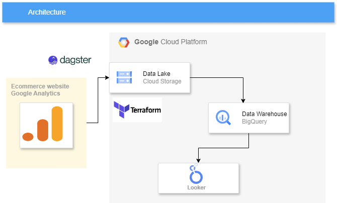
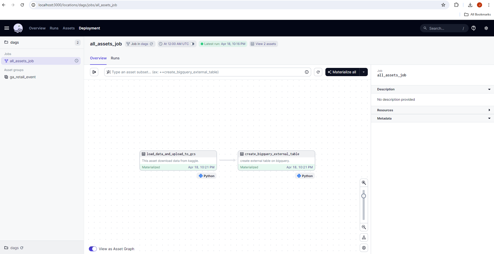
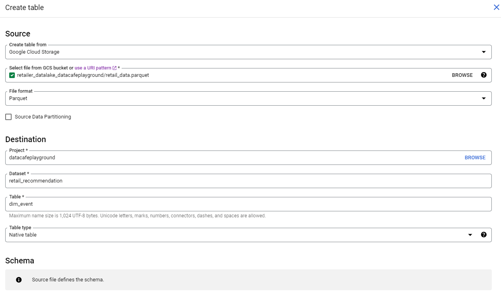
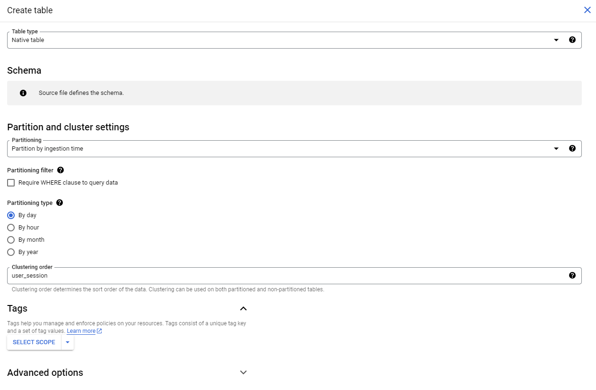
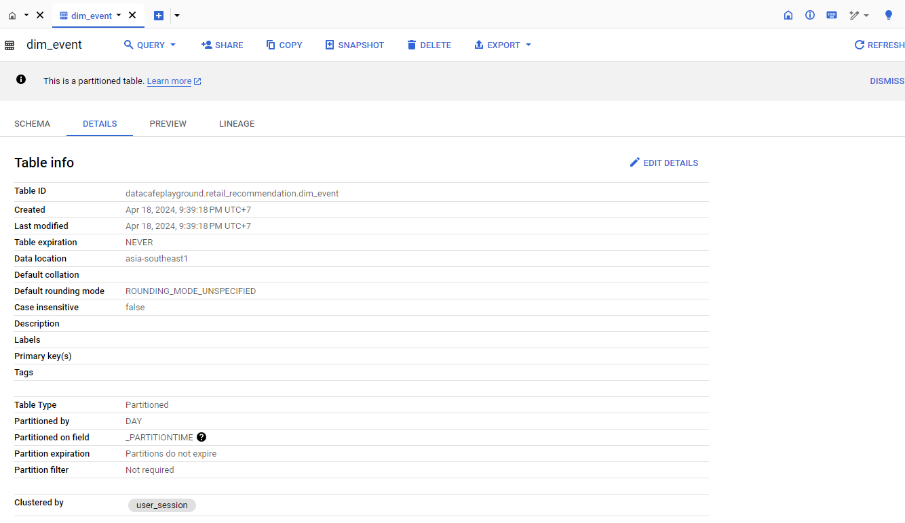
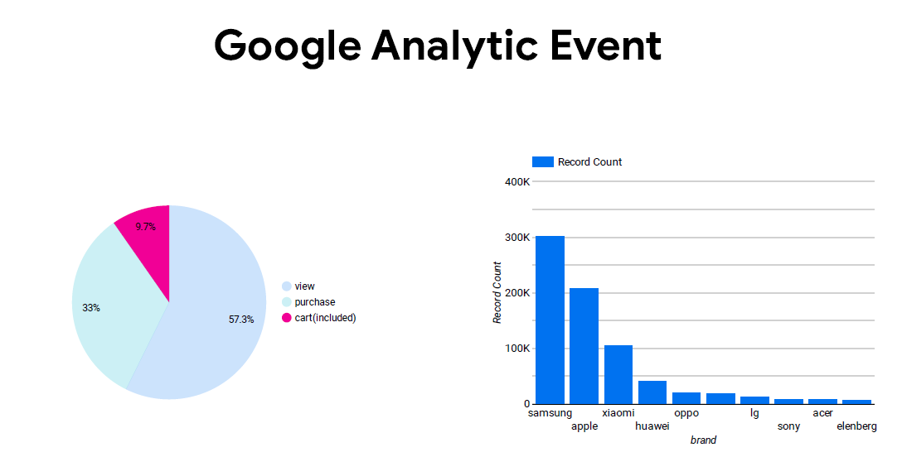

# Data Engineering Zoomcamp Project

## Problem Description

On ecommerce websites, there is a vast amount of website traffic data generated daily. Therefore, we would like to analyze this data using a data warehouse system to issue promotions aimed at increasing product sales.

### Main Problem

1.Know how many people visit your website in a month.

2.Know the number of event add to cart products, which product code, which brand, why haven't paid yet?

### Solution

Analyze the activities occurring on the website, including those related to adding items to the cart. Why haven't I paid yet?

## Architecture



#### Requirements

1. Python >=3.11
2. make
3. Poetry

#### Install Dependencies
Install Poetry (for other operating systems, check the steps on the [Poetry repo](https://github.com/python-poetry/poetry#installation))
```bash
# Linux
curl -sSL https://raw.githubusercontent.com/python-poetry/poetry/master/install-poetry.py | python3 -
```
Install dependencies 
```bash
poetry install
```

#### GCP Access

Use service account .json file store in local client

export environment variable
```bash
export GOOGLE_APPLICATION_CREDENTIALS= "<path to your key>"
```

example
```bash
export GOOGLE_APPLICATION_CREDENTIALS="/c/Users/ADMIN/.google/credentials/google_credentials.json"
```

#### Terraform

create gcs bucket
```bash
terraform init
```

```bash
terraform plan
```

```bash
terraform apply
```

#### Dagster
```bash
poetry shell
```
```bash
make start
```
or 
```bash
dagster dev
```
In localhost:3000 Deployment page click Materialize all



#### Data Warehouse

Data warehouse
After creating external tables to integrate data warehouse with datalake by dagster

I created a native table through bigquery by partitioning and clustering as shown in the picture.





#### Looker

